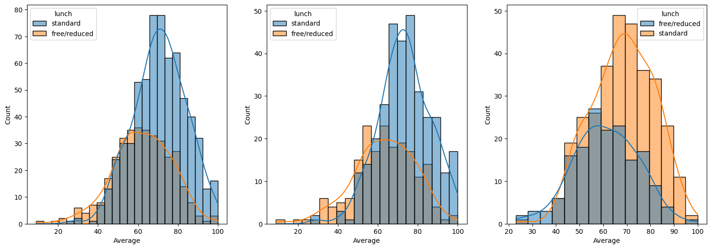
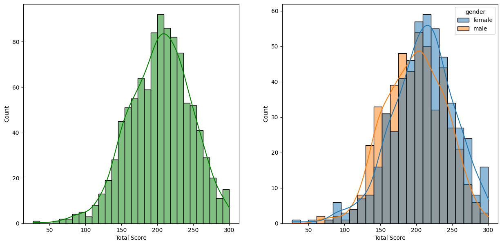

# 📚 Student Performance Indicator

## Problem Statement
This project aims to estimate student performance (test scores) and analyze how it is influenced by various factors such as Gender, Ethnicity, Parental Level of Education, Lunch, and Test Preparation Course.

## Exploratory Data Analysis (EDA)

### Data Collection
Collecting relevant datasets to analyze and draw insights from.

### Data Checks
Performing checks on the data to ensure accuracy and completeness.

### Exploring Data (Visualization)
Utilizing visualization techniques to gain deeper insights into the relationships between variables.

## 📊 Conclusions

### 1. Student's Performance and Demographics:
   - Student performance is significantly associated with variables such as lunch, race, and parental level of education.

### 2. Gender Disparities:
   - Females not only lead in pass percentage but also achieve top scores.

### 3. Test Preparation Course Impact:
   - Completion of test preparation courses shows a positive impact on student performance.

## 📈 Visual Highlights

Caption: The impact of lunch on student performance.

Caption: Visualization of gender-based performance disparities.
